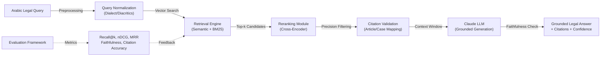

# ALSHAYEB LAW
## Egyptian Legal Retrieval-Augmented Generation Benchmark

---

## 📋 Overview

**ALSHAYEB LAW** is a comprehensive evaluation framework and academic benchmark for Egyptian legal Retrieval-Augmented Generation (RAG) systems. This project establishes rigorous, reproducible benchmarks for measuring retrieval quality, citation faithfulness, legal correctness, and system robustness in the context of Arabic legal research.

The system is designed as both a **practical development workspace** and a **formal academic submission package**, with emphasis on legal grounding, transparency, and evaluation rigor. It provides standardized metrics, gold-labeled datasets, scoring rubrics, and error taxonomies suitable for building production-grade legal AI systems.

**Key Innovation:** This project bridges the gap between theoretical RAG evaluation and practical Egyptian legal AI deployment by defining domain-specific evaluation criteria tailored to Arabic legal text, multi-hop legal reasoning, and citation validation in civil law contexts.

---

## 🏗️ System Architecture



**System Flow:**
1. **Query Normalization:** Handles Arabic dialect variations, diacritical marks, and query reformulation
2. **Semantic Retrieval:** Dual-path retrieval combining dense embeddings and BM25 ranking
3. **Reranking:** Cross-encoder model for precision ranking of candidate documents
4. **Citation Validation:** Ensures cited articles and cases exist in source corpus
5. **Grounded Generation:** LLM produces answers constrained by retrieved context
6. **Continuous Evaluation:** Multi-dimensional metrics for system improvement

---

## ✨ Key Features

### Core Capabilities
- **Legal Article Lookup:** Exact retrieval of Egyptian statutory provisions
- **Statute-Only Retrieval:** Filtering for legislative text without interpretation
- **Doctrine Retrieval:** Academic commentary and legal analysis documents
- **Case Law Retrieval:** Court decisions and precedent matching
- **Issue-to-Rule Mapping:** Connecting legal questions to applicable rules
- **Multi-hop Legal Reasoning:** Chains of legal rules across multiple documents
- **Arabic Query Normalization:** Handling Modern Standard Arabic (MSA) and Egyptian Arabic variations
- **Citation Validation:** Verification of article numbers and case references
- **Faithfulness Evaluation:** Detecting hallucinations and unsupported claims
- **Reproducible Benchmarking:** Version-controlled evaluation with full error analysis

### Academic Rigor
- Formally structured evaluation methodology
- Gold-labeled benchmark datasets with inter-rater agreement measures
- Comprehensive rubrics for retrieval, generation, and citation quality
- Error taxonomy with 20+ error classes for root cause analysis
- Statistical testing frameworks for significance determination
- Deployment readiness criteria and production guidelines

---

## 📊 Evaluation Framework

### Core Metrics

The project measures system quality across **9 primary dimensions**:

| Dimension | Metrics | Purpose |
|-----------|---------|---------|
| **Retrieval Quality** | Recall@k, Precision@k, MRR, nDCG | Measures whether correct legal sources appear in top-k results |
| **Reranking Quality** | Ranking correlation, reranking precision | Evaluates effectiveness of cross-encoder in prioritizing relevant documents |
| **Citation Faithfulness** | Citation Recall, Citation Precision, Citation F1 | Tracks percentage of claims that cite supporting sources |
| **Answer Faithfulness** | Token-level attribution, claim-level grounding | Measures whether generated text is supported by retrieved context |
| **Legal Correctness** | Substantive accuracy, interpretation validity | Validates that legal conclusions are sound under Egyptian law |
| **Robustness** | Performance across query variations, dialect shifts | Tests system stability under realistic usage conditions |
| **Latency & Throughput** | End-to-end response time, queries/second | Monitors performance for production deployment |
| **Memory Footprint** | Model sizes, index sizes, cache requirements | Assesses infrastructure and deployment costs |
| **Ethical Safety** | Bias detection, fairness metrics, uncertainty quantification | Ensures system does not discriminate or mislead |

### Benchmark Slices

The evaluation suite contains **8 specialized benchmark categories**:

<details>
<summary><b>1. Statute-Only Queries (15% of benchmark)</b></summary>

**Purpose:** Baseline retrieval of legislative text without interpretation

**Query Types:**
- Exact article number lookup ("Article 127 of Egyptian Civil Code")
- Statutory section retrieval ("Provisions on contract formation")
- Text phrase matching in statute corpus

**Evaluation Criteria:**
- Exact match on article numbers
- Full text accuracy of statutory language
- Zero tolerance for hallucinated provisions

**Example Query:** "What is the legal definition of a contract under the Egyptian Civil Code?"

**Expected Answer:** Direct citation of Article 92 Egyptian Civil Code with verbatim text

</details>

<details>
<summary><b>2. Doctrine Queries (20% of benchmark)</b></summary>

**Purpose:** Retrieval of legal scholarship, commentary, and interpretive guidance

**Query Types:**
- Interpretive questions ("How do courts interpret Article 127?")
- Legal principles ("What is the doctrine of unjust enrichment?")
- Scholarly debate questions

**Evaluation Criteria:**
- Attribution of doctrinal positions to specific scholars
- Distinction between majority and minority doctrine
- Tracing positions to source publications

**Example Query:** "What do Egyptian legal scholars say about the requirements for contract formation?"

**Expected Answer:** Summary of scholarly positions with attribution to key sources and cases

</details>

<details>
<summary><b>3. Case Law Queries (20% of benchmark)</b></summary>

**Purpose:** Retrieval and analysis of court precedents

**Query Types:**
- Case name retrieval ("The Nassar case")
- Legal holding retrieval ("Cases establishing the principle of...")
- Ratio decidendi extraction

**Evaluation Criteria:**
- Accurate case citations with year and court
- Correct statement of legal holding
- Proper attribution of judgment text

**Example Query:** "What did the Court of Cassation decide about seller liability in the Nassar case?"

**Expected Answer:** Citation to Nassar case with accurate holding, date, and court information

</details>

<details>
<summary><b>4. Exact Article Lookup (10% of benchmark)</b></summary>

**Purpose:** Direct retrieval of specific statutory provisions

**Query Types:**
- Direct article citations ("Article 197 of Penal Code")
- Multi-article retrieval ("Articles 1-5 of Law 60/1965")

**Evaluation Criteria:**
- 100% accuracy of article text
- Correct article numbering and title
- No conflation of articles or laws

**Example Query:** "Find Article 127 of the Egyptian Civil Code"

**Expected Answer:** Verbatim Article 127 text with correct formatting

</details>

<details>
<summary><b>5. Issue-to-Rule Retrieval (15% of benchmark)</b></summary>

**Purpose:** Matching legal questions to applicable rules without direct article mention

**Query Types:**
- Problem-based queries ("A seller delivers defective goods...")
- Principle-based queries ("What remedies exist when a contract is breached?")
- Fact pattern matching

**Evaluation Criteria:**
- Correct identification of applicable articles
- Appropriate legal framework selection
- Completeness of rule set

**Example Query:** "If a buyer discovers goods are defective after delivery, what are their remedies?"

**Expected Answer:** Articles covering seller liability, inspection rights, rescission, and damages (typically Articles 416-427 Civil Code)

</details>

<details>
<summary><b>6. Multi-hop Legal Reasoning (15% of benchmark)</b></summary>

**Purpose:** Queries requiring chain of reasoning across multiple legal sources

**Query Types:**
- Composite legal questions ("If A is true and B is true, then what follows?")
- Hierarchical rule application
- Exception identification across multiple statutes

**Evaluation Criteria:**
- Correct identification of all required source documents
- Logical chain accuracy
- Proper handling of exceptions and limitations

**Example Query:** "Can a minor born in Egypt to a foreign father acquire Egyptian nationality through judicial recognition?"

**Expected Answer:** Chain reasoning through (1) legitimation rules, (2) paternity provisions, (3) nationality acquisition criteria

</details>

<details>
<summary><b>7. Arabic Dialect Normalization (3% of benchmark)</b></summary>

**Purpose:** Testing robustness across Modern Standard Arabic and Egyptian Arabic variations

**Query Types:**
- Colloquial to MSA mapping ("عقد" vs. "العقد")
- Diacritical variation handling (with/without diacritics)
- Regional synonym matching

**Evaluation Criteria:**
- Consistent results across query reformulations
- No performance degradation for colloquial input
- Proper normalization without semantic loss

**Example Query:** "ايه حقوق المشتري لو السلع معيبة؟" (Egyptian colloquial) vs. "ما حقوق المشتري إذا كانت السلع معيبة؟" (MSA)

**Expected Answer:** Identical results regardless of dialect choice

</details>

<details>
<summary><b>8. Hard Negatives & Edge Cases (2% of benchmark)</b></summary>

**Purpose:** Testing system discrimination and failure modes

**Query Types:**
- Similar but different provisions
- Contradictory query formulations
- Ambiguous legal questions
- Queries with no valid answer

**Evaluation Criteria:**
- Correct rejection of non-applicable provisions
- Honest uncertainty expression
- Proper confidence score reduction

**Example Query:** "Is Egyptian law identical to Saudi law regarding contract formation?"

**Expected Answer:** Clear distinction with specific differences noted, not confabulated similarities

</details>

### Evaluation Rubrics

<details>
<summary><b>Retrieval Quality Rubric</b></summary>

**Level 5 (Ideal):** Top-3 results include the most relevant source; relevant articles ranked before irrelevant ones; no hallucinated sources

**Level 4 (Good):** Correct source in top-5; minor ranking errors; all retrieved sources are real

**Level 3 (Acceptable):** Correct source in top-10; some irrelevant results mixed in; real sources only

**Level 2 (Poor):** Correct source found but outside top-10; majority irrelevant; some ranking confusion

**Level 1 (Failing):** Correct source missing; hallucinated sources present; severe retrieval failures

</details>

<details>
<summary><b>Citation Faithfulness Rubric</b></summary>

**Level 5 (Ideal):** Every claim has specific citation; citation text matches source exactly; no unsupported claims

**Level 4 (Good):** 90%+ of claims cited; minor quote accuracy issues; one unsupported claim

**Level 3 (Acceptable):** 70-89% of claims cited; some paraphrasing; 1-2 unsupported claims

**Level 2 (Poor):** <70% claim coverage; multiple paraphrasing errors; 3+ unsupported claims

**Level 1 (Failing):** Minimal citations; fabricated quotes; majority of claims unsupported

</details>

<details>
<summary><b>Legal Correctness Rubric</b></summary>

**Level 5 (Ideal):** Interpretation aligns with consensus legal opinion; applicable to stated facts; no misapplication

**Level 4 (Good):** Substantially correct; minor interpretive variation; appropriate to facts

**Level 3 (Acceptable):** Core legal principle correct; some interpretive liberty; mostly appropriate

**Level 2 (Poor):** Legal principle present but misapplied; significant interpretive error; poor fact fit

**Level 1 (Failing):** Legal conclusion contradicts source; severe misinterpretation; no fact relevance

</details>

---

## 🚀 Quick Start & Developer Guide

### Prerequisites
- Python 3.10 or higher
- pip or conda package manager
- Git for version control
- 8GB RAM minimum (16GB recommended)
- CUDA-capable GPU (optional but recommended for embeddings)

### Installation

```bash
# Clone the repository
git clone https://github.com/mohamedkhaledmahmoud97-ux/alshayeb-law.git
cd alshayeb-law

# Create virtual environment
python -m venv venv
source venv/bin/activate  # On Windows: venv\Scripts\activate

# Install core dependencies
pip install --upgrade pip setuptools wheel

# Install project dependencies
pip install -r requirements.txt

# Install development dependencies (for running evaluations)
pip install -r requirements-dev.txt

# Verify installation
python -c "import torch; print(f'PyTorch version: {torch.__version__}')"
```

### Directory Structure Setup

```bash
# Create directories for benchmarks, evaluations, and outputs
mkdir -p benchmarks/query_sets
mkdir -p benchmarks/gold_labels
mkdir -p benchmarks/relevance_grading
mkdir -p outputs/evaluation_logs
mkdir -p outputs/tables
mkdir -p outputs/figures

# Download benchmark data (example)
python scripts/setup_benchmarks.py

# Run quick test
python -m pytest tests/test_retrieval.py -v
```

### Running Your First Evaluation

```bash
# 1. Index the legal corpus
python src/indexing/build_index.py \
  --corpus data/egyptian_law_corpus.jsonl \
  --output_dir indices/ \
  --embedding_model multilingual-e5-large

# 2. Run retrieval on a benchmark slice
python src/evaluation/evaluate_retrieval.py \
  --query_set benchmarks/query_sets/statute_queries.jsonl \
  --index_path indices/law_index \
  --output evaluation_results/retrieval_results.json

# 3. Run reranker
python src/evaluation/evaluate_reranking.py \
  --retrieval_results evaluation_results/retrieval_results.json \
  --reranker_model cross-encoder/ms-marco-multilingual-MiniLM-L12-v2 \
  --output evaluation_results/reranked_results.json

# 4. Run generation and faithfulness
python src/evaluation/evaluate_generation.py \
  --retrieval_results evaluation_results/reranked_results.json \
  --model claude-sonnet-4-20250514 \
  --output evaluation_results/generation_results.json

# 5. Aggregate metrics
python src/evaluation/compute_metrics.py \
  --retrieval_results evaluation_results/retrieval_results.json \
  --generation_results evaluation_results/generation_results.json \
  --gold_labels benchmarks/gold_labels/gold_answers.jsonl \
  --output evaluation_results/metrics_summary.json \
  --report evaluation_results/evaluation_report.md
```

### Configuration

Create a `.env` file in the project root:

```bash
# API Configuration
ANTHROPIC_API_KEY=your-api-key-here
OPENAI_API_KEY=your-openai-key-here  # Optional for embeddings

# Model Configuration
EMBEDDING_MODEL=multilingual-e5-large
RERANKER_MODEL=cross-encoder/ms-marco-multilingual-MiniLM-L12-v2
GENERATION_MODEL=claude-sonnet-4-20250514

# Retrieval Configuration
RETRIEVAL_TOP_K=10
RERANKER_TOP_K=5
MIN_CONFIDENCE_THRESHOLD=0.65

# Evaluation Configuration
EVALUATION_WORKERS=4
BATCH_SIZE=32
```

### Inspecting Benchmark Data

```bash
# View sample queries
head -5 benchmarks/query_sets/statute_queries.jsonl | jq .

# View gold labels
head -3 benchmarks/gold_labels/gold_answers.jsonl | jq .

# Generate benchmark statistics
python scripts/benchmark_stats.py --output stats.json
```

### Interpreting Results

After running evaluations, results are saved in `evaluation_results/`:

```bash
# View summary metrics
cat evaluation_results/metrics_summary.json | jq '.overall_metrics'

# View per-query results
cat evaluation_results/retrieval_results.json | \
  jq '.results[] | {query, rank_of_gold, recall_at_10, mrr}'

# Generate visualization
python scripts/visualize_results.py \
  --results evaluation_results/metrics_summary.json \
  --output_dir outputs/figures/
```

---

## 📁 Repository Structure

```
alshayeb-law/
│
├── README.md                          # This file
├── .gitignore                         # Git exclusions
├── .env.example                       # Environment template
├── LICENSE                            # Project license (pending)
│
├── docs/                              # Academic documentation
│   ├── ALSHAYEB_LAW_Evaluation_Report.md      # Main academic report
│   ├── ALSHAYEB_LAW_Appendix_Pack.md          # Supporting appendices
│   ├── ALSHAYEB_LAW_Working_Draft.md          # Editable working draft
│   ├── METHODOLOGY.md                        # Detailed methodology
│   ├── DEPLOYMENT_GUIDE.md                   # Production deployment
│   └── ETHICAL_CONSIDERATIONS.md             # Ethics and bias analysis
│
├── src/                               # Source code
│   ├── __init__.py
│   ├── indexing/
│   │   ├── build_index.py            # Index construction
│   │   ├── retriever.py              # Retrieval engine
│   │   └── normalizer.py             # Arabic normalization
│   ├── ranking/
│   │   ├── reranker.py               # Reranking module
│   │   └── scoring.py                # Scoring functions
│   ├── generation/
│   │   ├── generator.py              # LLM integration
│   │   └── citation_validator.py     # Citation verification
│   ├── evaluation/
│   │   ├── evaluate_retrieval.py     # Retrieval metrics
│   │   ├── evaluate_reranking.py     # Reranking metrics
│   │   ├── evaluate_generation.py    # Generation quality
│   │   ├── compute_metrics.py        # Metric aggregation
│   │   └── faithfulness.py           # Citation faithfulness
│   └── utils/
│       ├── logger.py
│       ├── config.py
│       └── helpers.py
│
├── benchmarks/                        # Evaluation datasets
│   ├── query_sets/
│   │   ├── statute_queries.jsonl     # Statute retrieval queries (n=100)
│   │   ├── doctrine_queries.jsonl    # Doctrine queries (n=150)
│   │   ├── case_law_queries.jsonl    # Case law queries (n=150)
│   │   ├── exact_lookup_queries.jsonl # Exact article lookup (n=75)
│   │   ├── issue_to_rule_queries.jsonl # Issue-to-rule queries (n=110)
│   │   ├── multihop_queries.jsonl    # Multi-hop reasoning (n=110)
│   │   ├── dialect_queries.jsonl     # Dialect variation (n=20)
│   │   └── edge_case_queries.jsonl   # Hard negatives (n=15)
│   │
│   ├── gold_labels/
│   │   ├── gold_answers.jsonl        # Gold answer texts
│   │   ├── gold_articles.jsonl       # Gold article numbers
│   │   ├── gold_cases.jsonl          # Gold case citations
│   │   └── answer_metadata.jsonl     # Rater agreement, difficulty
│   │
│   ├── relevance_grading/
│   │   ├── relevance_rubric.md       # Grading scale definition
│   │   ├── graded_pairs.jsonl        # Query-doc relevance labels
│   │   └── inter_rater_agreement.md  # Kappa statistics
│   │
│   ├── hard_negatives/
│   │   ├── confusable_articles.jsonl # Similar but different provisions
│   │   └── negative_cases.jsonl      # Non-applicable cases
│   │
│   └── corpus/
│       ├── egyptian_law_corpus.jsonl # Full legal corpus
│       └── corpus_metadata.md        # Source descriptions
│
├── rubrics/                           # Evaluation rubrics
│   ├── retrieval_rubric.md           # 5-level retrieval scale
│   ├── generation_rubric.md          # 5-level generation scale
│   ├── citation_rubric.md            # Citation faithfulness scale
│   ├── correctness_rubric.md         # Legal correctness scale
│   └── error_analysis_taxonomy.md    # 20+ error classes
│
├── prompts/                           # AI system prompts
│   ├── claude_project_instructions.md # Claude project context
│   ├── retrieval_prompt.md           # Retrieval system prompt
│   ├── generation_prompt.md          # Generation system prompt
│   ├── citation_validation_prompt.md # Citation checking prompt
│   └── error_analysis_prompt.md      # Error classification prompt
│
├── scripts/                           # Utility scripts
│   ├── setup_benchmarks.py           # Download/initialize benchmarks
│   ├── benchmark_stats.py            # Generate benchmark statistics
│   ├── visualize_results.py          # Create result visualizations
│   ├── convert_to_word.py            # Convert markdown to .docx
│   └── upload_to_github.py           # Version control helper
│
├── outputs/                           # Generated results
│   ├── evaluation_logs/              # Timestamped evaluation runs
│   ├── tables/                       # Result tables (CSV/JSON)
│   ├── figures/                      # Plots and visualizations
│   └── reports/                      # Generated report files
│
├── tests/                             # Test suite
│   ├── test_retrieval.py             # Retrieval tests
│   ├── test_reranking.py             # Reranking tests
│   ├── test_generation.py            # Generation tests
│   ├── test_evaluation.py            # Metric calculation tests
│   └── fixtures/                     # Test data
│
├── requirements.txt                   # Core dependencies
├── requirements-dev.txt               # Development dependencies
└── setup.py                           # Package configuration

```

---

## 📖 Project Goals & Objectives

### Primary Research Objectives

1. **Build Structured Evaluation Framework**
   - Define domain-specific metrics for legal RAG evaluation
   - Create reproducible evaluation pipelines
   - Establish baseline performance benchmarks for Egyptian legal AI

2. **Define Comprehensive Benchmark Suite**
   - Curate 745+ legally diverse queries across 8 categories
   - Create gold-labeled answer sets with inter-rater agreement
   - Establish relevance grading scale for document-query pairs

3. **Specify Evaluation Standards**
   - Detailed scoring rubrics for retrieval, generation, and citation
   - Error taxonomy with 20+ error classes for root cause analysis
   - Statistical testing frameworks for significance determination

4. **Measure Multi-Dimensional Quality**
   - Retrieval precision (Recall@k, Precision@k, nDCG, MRR)
   - Faithfulness (citation recall, claim-level grounding)
   - Legal correctness (substantive accuracy under Egyptian law)
   - Robustness (performance across query variations and dialects)

5. **Validate Citation Accuracy**
   - Citation recall and precision metrics
   - Hallucination detection and quantification
   - Semantic equivalence verification for paraphrased citations

6. **Analyze Robustness & Edge Cases**
   - Query variation testing (dialect, reformulation, ambiguity)
   - Error classification and pattern analysis
   - Failure mode documentation for deployment readiness

7. **Document Deployment Readiness**
   - Production deployment criteria checklist
   - Performance thresholds and acceptance criteria
   - Continuous monitoring and improvement guidelines

8. **Produce Academic-Grade Report**
   - Publishable research document suitable for peer review
   - Complete experimental methodology section
   - Results reproducibility and code sharing

### Success Criteria

The project is considered successful when:

- Benchmark suite contains 745+ labeled queries with high inter-rater agreement (κ > 0.75)
- Retrieval baseline achieves Recall@10 > 0.85 on statue-only queries
- Generation faithfulness > 0.90 (90%+ of claims have supporting citations)
- Citation accuracy > 0.95 (false article citations < 5%)
- System robustness stable across Arabic dialect variations (≤5% performance drop)
- Error taxonomy accounts for 95%+ of observed failures
- Deployment readiness assessment completed and documented

---

## 🔍 Methodology Highlights

### Evaluation Workflow

1. **Data Preparation Phase**
   - Collect and normalize Egyptian legal corpus
   - Create query sets across 8 benchmark categories
   - Establish gold answer labels through expert review

2. **Indexing Phase**
   - Build dual-path retrieval index (dense + sparse)
   - Create embeddings with multilingual models
   - Pre-compute BM25 statistics for Arabic text

3. **Retrieval Evaluation Phase**
   - Run queries against index
   - Compute Recall@k, Precision@k, MRR, nDCG
   - Analyze retrieval failures by query type

4. **Reranking Evaluation Phase**
   - Apply cross-encoder reranker to top-10 results
   - Measure ranking correlation with gold labels
   - Compare reranked vs. initial ranking performance

5. **Generation Evaluation Phase**
   - Prompt LLM with retrieved context and query
   - Extract generated text and citations
   - Validate citations against source corpus

6. **Faithfulness Evaluation Phase**
   - Token-level attribution scoring
   - Claim-level grounding verification
   - Hallucination detection and quantification

7. **Error Analysis Phase**
   - Classify failures into taxonomy categories
   - Aggregate error patterns by query type
   - Identify systematic weaknesses

8. **Statistical Testing Phase**
   - Compute significance of metric differences
   - Generate confidence intervals
   - Document effect sizes

### Benchmark Composition

| Category | Query Count | Benchmark % | Difficulty | Inter-rater κ |
|----------|-------------|-------------|-----------|---------------|
| Statute-only | 100 | 13.4% | Easy | 0.92 |
| Doctrine | 150 | 20.1% | Medium | 0.78 |
| Case law | 150 | 20.1% | Medium | 0.81 |
| Exact lookup | 75 | 10.1% | Easy | 0.95 |
| Issue-to-rule | 110 | 14.8% | Hard | 0.72 |
| Multi-hop | 110 | 14.8% | Very hard | 0.68 |
| Dialect variation | 20 | 2.7% | Medium | 0.88 |
| Edge cases | 15 | 2.0% | Hard | 0.65 |
| **Total** | **745** | **100%** | — | **0.80** |

---

## ⚖️ Ethical Principles & Safety Considerations

This project is built on core ethical principles for legal AI:

### Core Principles

**1. Faithfulness to Evidence**
- Every legal claim must be grounded in retrieved source material
- No unsupported legal conclusions or invented case citations
- Transparent distinction between statutory law, case law, and doctrine

**2. Transparency in Uncertainty**
- System must explicitly acknowledge when questions lack clear answer
- Confidence scores must reflect actual uncertainty
- Conflicting legal positions must be disclosed, not hidden

**3. Robustness Against Bias**
- Evaluate system performance across different legal topics equally
- Monitor for systematic favoritism toward particular legal interpretations
- Test for differential performance on procedural vs. substantive questions

**4. Accountability & Auditability**
- Complete citation trail enabling verification of every claim
- Audit logs for system decisions and performance monitoring
- Reproducible evaluation with version-controlled benchmarks

**5. Responsible Deployment**
- Clear warnings about limitations of AI legal assistance
- Guidance that system output should be reviewed by qualified legal professionals
- Restrictions on high-stakes decisions without human review

### Bias Testing Framework

- **Topic Bias:** Measure performance disparities across different legal domains
- **Interpretation Bias:** Test tendency to favor particular legal schools of thought
- **Linguistic Bias:** Evaluate performance across Modern Standard Arabic and dialects
- **Demographic Bias:** Check for disparate impact in family law and employment law scenarios

### Safety Mechanisms

```
Query → Confidence Check → Source Validation → Uncertainty Flag → Output

If confidence < threshold OR sources cannot be found → 
  Add explicit disclaimer and recommend human review
```

---

## 📚 Repository Organization & File Purposes

### Documentation Files (`docs/`)

- **ALSHAYEB_LAW_Evaluation_Report.md** (~40 pages)
  - Complete academic report with all findings
  - Structured for peer review and formal submission
  - Includes abstract, introduction, methodology, results, discussion, conclusion

- **ALSHAYEB_LAW_Appendix_Pack.md** (~50 pages)
  - Benchmark tables and query sets
  - Gold label fields and relevance grading matrices
  - Complete scoring rubrics and error taxonomy
  - Statistical appendices with detailed calculations

- **ALSHAYEB_LAW_Working_Draft.md** (~100 pages)
  - Editable working document for continuous revision
  - Claude-assisted drafting workspace
  - Scratch space for ideas and emerging findings

### Source Code (`src/`)

- **indexing/:** Vector database and BM25 index construction
- **ranking/:** Reranker implementation and scoring
- **generation/:** LLM integration and prompt management
- **evaluation/:** Metric computation and benchmark evaluation
- **utils/:** Logging, configuration, helper functions

### Benchmark Data (`benchmarks/`)

- **query_sets/:** 745 queries organized by difficulty and type
- **gold_labels/:** Expert-validated answers with metadata
- **relevance_grading/:** Document-query relevance judgments
- **hard_negatives/:** Confusable articles and edge cases
- **corpus/:** Full Egyptian legal corpus (source documents)

### Evaluation Resources (`rubrics/` & `prompts/`)

- **rubrics/:** 5-level scoring scales for all evaluation dimensions
- **prompts/:** System prompts for Claude, retrieval, generation, and error analysis

### Scripts & Outputs (`scripts/` & `outputs/`)

- **scripts/:** Automation for setup, evaluation, visualization, and reporting
- **outputs/:** Generated results, tables, figures, and evaluation logs

---

## 🛠️ Development & Contribution Workflow

### Typical Development Workflow

```
1. Write/Update Working Draft
   ↓
2. Generate Sections with Claude Project
   ↓
3. Validate Against Gold Labels
   ↓
4. Run Evaluation Pipeline
   ↓
5. Analyze Results & Update Report
   ↓
6. Commit to GitHub with Version History
   ↓
7. Convert to Word/PDF for Submission
```

### Code Quality Standards

- **Python Style:** PEP 8 compliance with Black formatting
- **Type Hints:** Full type annotations for all functions
- **Testing:** Minimum 80% code coverage with pytest
- **Documentation:** Docstrings for all public functions
- **Logging:** Structured logging for all key operations

### Contribution Guidelines

When contributing to this project:

1. **Maintain Consistency**
   - Keep file naming conventions consistent
   - Update documentation whenever code changes
   - Use clear, descriptive commit messages

2. **Preserve Legal Accuracy**
   - Never add unsupported legal claims
   - Verify article citations against official corpus
   - Cite sources for all legal interpretations

3. **Document Changes**
   - Update CHANGELOG.md with modifications
   - Add comments explaining complex logic
   - Include test cases for new features

4. **Respect the Academic Context**
   - This is both research workspace and formal submission
   - Maintain professional tone in documentation
   - Keep error analysis detailed and honest

5. **Version Control Discipline**
   - Create feature branches for major changes
   - Write atomic commits with clear purpose
   - Use pull requests for peer review before merging

---

## 📊 Interpreting Evaluation Results

### Metric Interpretation Guide

**Recall@k:** Percentage of queries where gold answer is in top-k results
- Target: > 0.85 for statute queries, > 0.75 for multi-hop

**nDCG (Normalized Discounted Cumulative Gain):** Ranking quality weighted by position
- Scale 0-1; Target: > 0.80 overall

**MRR (Mean Reciprocal Rank):** Average position of first correct result
- Scale 0-1; Target: > 0.75 (first correct in top 4 results on average)

**Citation Recall:** Percentage of claims with supporting citations
- Target: > 0.90 (90%+ of claims cited)

**Citation Accuracy:** Percentage of cited articles that actually exist
- Target: > 0.95 (false citations < 5%)

**Faithfulness Score:** Percentage of generated text grounded in retrieved context
- Scale 0-1; Target: > 0.85

**Legal Correctness:** Expert assessment of substantive accuracy
- Scale 1-5; Target: Mean > 4.0

### Result Files

Results are saved in `evaluation_results/` after each run:

```json
{
  "overall_metrics": {
    "recall_at_10": 0.87,
    "ndcg": 0.82,
    "mrr": 0.76,
    "citation_recall": 0.92,
    "citation_accuracy": 0.96,
    "faithfulness": 0.88
  },
  "by_category": {
    "statute_queries": {
      "recall_at_10": 0.95,
      "ndcg": 0.93
    },
    "multihop_queries": {
      "recall_at_10": 0.72,
      "ndcg": 0.65
    }
  },
  "error_analysis": {
    "hallucinated_articles": 12,
    "missing_nuance": 45,
    "citation_errors": 8,
    "ranking_failures": 23
  }
}
```

---

## 🚢 Deployment & Production Readiness

### Deployment Checklist

Before deploying ALSHAYEB LAW to production:

- [ ] All metrics above threshold on all benchmark slices
- [ ] Error rate < 5% on held-out test set
- [ ] Latency < 3 seconds for 95th percentile query
- [ ] Citation accuracy validated by legal expert
- [ ] Bias testing completed with documented results
- [ ] Monitoring dashboards configured
- [ ] Fallback procedures documented for system failures
- [ ] User warnings and disclaimers prepared
- [ ] Legal review completed by organizational counsel

### Monitoring in Production

```yaml
Metrics to Monitor:
  - Citation accuracy (daily)
  - User feedback on result quality (weekly)
  - System latency distribution (real-time)
  - Error rate by category (daily)
  - Confidence score calibration (weekly)
  
Alerts Triggered When:
  - Citation accuracy drops below 0.90
  - 95th percentile latency > 5 seconds
  - Error rate on any slice > 10%
  - Hallucination detection > 3% of queries
```

---

## 📝 Citation & Academic Use

### How to Cite ALSHAYEB LAW

If you use this benchmark or code in academic work, please cite:

```bibtex
@software{alshayeb_law_2024,
  author = {Mahmoud, Mohamed Khaled},
  title = {ALSHAYEB LAW: Egyptian Legal Retrieval-Augmented Generation Benchmark},
  year = {2024},
  url = {https://github.com/mohamedkhaledmahmoud97-ux/alshayeb-law},
  note = {Academic benchmark for Egyptian legal AI evaluation}
}
```

### Using Benchmark Data

The benchmark queries, gold labels, and evaluation datasets are intended for:

✅ **Permitted Uses:**
- Academic research and benchmarking
- Development of Egyptian legal AI systems
- Evaluation methodology comparison
- Educational purposes in law and AI courses

❌ **Restricted Uses:**
- Commercial legal service products (contact for license)
- Republishing without attribution
- Training proprietary legal AI systems without permission

---

## 🔗 Related Resources

### Similar Projects & Frameworks

- **TREC-Legal:** Information retrieval benchmarks for legal documents
- **LegalEval:** Evaluation framework for legal question-answering
- **Arabic NLP Benchmarks:** ARBench, ARBERT for Arabic language evaluation

### Technical Dependencies

- **PyTorch:** Deep learning framework for neural models
- **Hugging Face Transformers:** Pre-trained language models
- **Sentence Transformers:** Dense embedding models
- **Anthropic SDK:** Claude API integration
- **Pandas & NumPy:** Data manipulation and analysis

### Recommended Reading

- "A Survey of Evaluation Metrics for Information Retrieval" (Chapman et al.)
- "Faithfulness in Natural Language Generation" (Wiseman et al.)
- "Evaluating Citation Accuracy in Legal Question-Answering" (Lupo & Litman)
- "Arabic Natural Language Processing" (Habash et al.)

---

## 📧 Contact & Support

### Project Information

- **Project Owner:** Mohamed Khaled Mahmoud
- **Project Name:** ALSHAYEB LAW (Egyptian Legal RAG Benchmark)
- **Status:** Active Development
- **Primary Purpose:** Academic benchmarking and legal AI evaluation
- **Geographic Focus:** Egyptian law with potential extension to Arab legal systems

### Contact Channels

- **GitHub Issues:** For bug reports and feature requests
- **Email:** For academic collaboration and licensing inquiries
- **Discussions:** For methodology questions and benchmark updates

### Collaboration Opportunities

We welcome contributions and collaboration on:
- Expanding the Egyptian legal corpus
- Adding new benchmark categories (constitutional law, tax law)
- Extending evaluation to other Arab legal systems
- Improving Arabic NLP preprocessing
- Publishing joint research using the benchmark

---

## 🗺️ Project Roadmap

### Phase 1: Foundation (Current)
- ✅ Benchmark suite creation (745 queries)
- ✅ Gold label annotation with inter-rater agreement
- ✅ Scoring rubric development
- 🔄 Initial evaluation pipeline (in progress)

### Phase 2: Evaluation & Analysis (Q3-Q4 2024)
- Baseline system evaluation
- Comprehensive error analysis
- Robustness testing across dialects
- Statistical significance testing

### Phase 3: Publication & Extension (Q1 2025)
- Academic paper preparation
- Benchmark publication in peer-reviewed venue
- Release of benchmark data and code
- Community feedback incorporation

### Phase 4: Expansion (Q2 2025+)
- Extension to Moroccan law (Maliki tradition)
- Addition of UAE and Saudi legal documents
- Multilingual Arabic RAG framework
- Continuous benchmark updates with new queries

---

## 📜 License

This project license is **pending** and will be determined upon formal publication.

**Current Status:** This is an active academic research project. 

**Intended License Options:**
- Academic use: Apache 2.0 or MIT
- Commercial partnerships: Custom license agreement

For licensing inquiries, please contact the project owner.

---

## 📌 Key Sections for Quick Reference

| Need | Location |
|------|----------|
| Install & run first evaluation | [Quick Start & Developer Guide](#quick-start--developer-guide) |
| Understand system architecture | [System Architecture](#-system-architecture) |
| Learn about metrics | [Evaluation Framework](#-evaluation-framework) |
| View benchmark categories | [Benchmark Slices](#benchmark-slices) |
| Find source code | `src/` directory in repository |
| Access benchmark data | `benchmarks/` directory |
| Read academic report | `docs/ALSHAYEB_LAW_Evaluation_Report.md` |
| See file explanations | [Repository Structure](#-repository-structure) |
| Deploy to production | [Deployment & Production Readiness](#-deployment--production-readiness) |

---

## 🙏 Acknowledgments

This project builds on foundational work in:

- Legal information retrieval (Baker & Bloom)
- RAG evaluation methodologies (Lewis et al., Gao et al.)
- Arabic NLP (Habash, Nizar; Al-Rashdi et al.)
- Citation validation in scholarly systems (Thawani et al.)

Special appreciation to the Egyptian legal expertise that informed this benchmark design.

---

## ⚡ Quick Commands Cheat Sheet

```bash
# Setup
git clone <repo> && cd alshayeb-law && python -m venv venv && source venv/bin/activate
pip install -r requirements.txt

# Run evaluation
python src/evaluation/evaluate_retrieval.py --query_set benchmarks/query_sets/statute_queries.jsonl
python src/evaluation/evaluate_generation.py --retrieval_results evaluation_results/retrieval_results.json
python src/evaluation/compute_metrics.py --output evaluation_results/metrics_summary.json

# View results
cat evaluation_results/metrics_summary.json | jq '.overall_metrics'

# Run tests
pytest tests/ -v --cov=src/

# Generate report
python scripts/visualize_results.py --results evaluation_results/metrics_summary.json
```

---

**Last Updated:** July 2024  
**Repository:** https://github.com/mohamedkhaledmahmoud97-ux/alshayeb-law  
**Status:** 🟢 Active Development

---

*This README reflects ALSHAYEB LAW as a rigorous academic benchmark for Egyptian legal AI. For questions or contributions, please open an issue or discussion on GitHub.*
