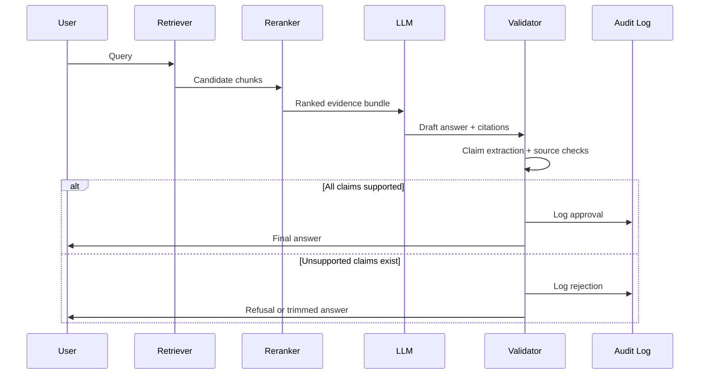

# @Academic

You are a legal NLP architect designing a Citation Validation layer for an Egyptian Legal RAG system named “ALSHAYEB LAW”.

Design a robust citation validation architecture that ensures every legal claim in the final answer is supported by verified retrieved evidence.

The design must include:

1. Purpose and threat model.
2. Types of citation errors.
3. Citation schema.
4. Evidence linking strategy.
5. Retrieval-to-citation mapping.
6. Validation rules.
7. Confidence scoring.
8. Fallback behavior when evidence is insufficient.
9. Audit logging.
10. Human review escalation.
11. Integration with the LLM output schema.
12. Evaluation metrics for citation accuracy.

Mandatory requirements:

- The layer must detect unsupported claims.
- The layer must reject hallucinated article numbers, case names, and doctrine references.
- The layer must verify that cited sources exist in the retrieved context.
- The layer must verify that every legal proposition maps to at least one evidence span.
- The layer must support statutes, rulings, and doctrine.
- The layer must support exact and approximate citation matching.
- The layer must support provenance and version control.

Design principles:

- Evidence-first.
- Conservative validation.
- Zero trust toward model-generated citations.
- Deterministic checks where possible.
- Explainable rejection reasons.

Output format:

- Formal technical English.
- Include a flowchart or sequence diagram.
- Include pseudo-logic for validation rules.
- Include recommended data structures.
- Include failure handling and fallback prompts.

Below is a robust **citation validation architecture** for **ALSHAYEB LAW**. It is designed as a deterministic evidence gate that sits between retrieval and final response delivery, because RAG systems can still generate unsupported or poorly attributed citations even when retrieval is correct. The design therefore follows an **evidence-first, zero-trust** principle toward model-generated citations and validates both correctness and faithfulness rather than assuming they are the same thing.[^1][^2][^3]

## 1. Purpose and threat model

The purpose of the citation validation layer is to guarantee that every legal proposition in the final answer is supported by retrieved evidence and that every cited statute, ruling, or doctrinal reference exists in the retrieved context. This is necessary because modern RAG pipelines can produce plausible but unfaithful citations, including citations that are correct in form but unsupported by the text.[^2][^3]

The threat model includes hallucinated article numbers, fabricated case names, incorrect doctrine references, source drift across versions, and answer text that exceeds the support of the retrieved evidence. It also includes post-rationalization, where the model produces citations that look correct but were not actually used as supporting evidence.[^4][^2]

## 2. Citation error types

The validator should detect at least six citation error classes. First, **fabricated citations**, where the model mentions a statute, article, case, or doctrine source that does not exist in the retrieval bundle. Second, **mismatched citations**, where the citation exists but does not support the claim. Third, **partial support**, where a citation supports only part of a sentence. Fourth, **version errors**, where the cited law article exists but under a different effective version. Fifth, **scope errors**, where a doctrine or judgment is cited outside its topical context. Sixth, **orphan claims**, where a legal proposition appears with no supporting citation at all.[^3][^1][^2]

For Egyptian legal use, the validator must also detect article-number drift, case-number drift, and law-title normalization errors, because users may reference legal sources in abbreviated or colloquial forms that the model then expands incorrectly.

## 3. Citation schema

Use a strict citation schema that separates the model’s generated citation token from the canonical evidence record. Each citation should point to a normalized source identifier, a version hash, a span reference, and a support relation.

### Recommended data structure

```json
{
  "citation_id": "cit_000123",
  "source_type": "statute | ruling | doctrine",
  "canonical_source_id": "law_45_art_12_v3",
  "display_reference": "Article 12, Law No. 45 of 1982",
  "version_hash": "sha256:...",
  "chunk_id": "chunk_8821",
  "span_start": 153,
  "span_end": 276,
  "support_strength": "full | partial | weak",
  "matched_claim_ids": ["claim_01", "claim_02"],
  "retrieval_rank": 2,
  "validation_status": "supported | partial | unsupported"
}
```

This schema is intentionally more structured than a plain inline citation because legal traceability requires article-level identity, version control, and span-level evidence.[^5][^6][^7]

## 4. Evidence linking strategy

The system should treat evidence as a chain: **retrieved chunk → cited source → supported claim**. The retriever produces candidate chunks, the reranker selects the most relevant ones, and the citation validator checks whether each claim in the draft answer maps to a span inside one of those chunks.

For statutes, the best linking unit is the article. For rulings, the linking unit should be the holding or reasoning paragraph. For doctrine, the linking unit should be the section or paragraph that states the legal interpretation. This source-aware linking is essential because the same query may require a rule from a statute, a judicial application, and a doctrinal explanation.[^8][^1][^3]

## 5. Retrieval-to-citation mapping

A retrieval-to-citation mapping table should be generated before the LLM answers. It links each top retrieved chunk to a canonical source and a support confidence score. The LLM may only cite from this table.

### Recommended mapping structure

```python
retrieval_map = [
    {
        "claim_id": "claim_01",
        "candidate_source_ids": ["law_45_art_12_v3", "law_45_art_13_v3"],
        "best_span": (153, 276),
        "support_score": 0.91
    }
]
```

This mapping should be computed from retrieval metadata and optional entailment scoring, not from the generated answer alone. That separation is important because citation generation can be superficially correct even when the underlying support is weak.[^2][^3]

## 6. Validation rules

The validator should apply deterministic rules before any answer is released.

### Pseudo-logic

```text
For each generated claim c:
    Retrieve linked evidence spans E from the evidence bundle.
    If E is empty:
        mark c as unsupported.
    Else:
        If source_id of cited reference not in evidence bundle:
            reject citation.
        If version_hash does not match active source version:
            reject citation.
        If claim semantics are not entailed by any span in E:
            mark as partial or unsupported.
        If citation refers to article/case/doctrine not present in metadata:
            reject citation.
If any mandatory legal claim is unsupported:
    either remove the claim or trigger refusal.
```


### Core validation checks

- **Existence check:** the cited source must exist in retrieved evidence.
- **Version check:** the cited source must match the current or selected legal version.
- **Span support check:** the claim must be entailed or directly supported by the source span.
- **Source-type check:** statute, ruling, and doctrine must be cited according to their own schema.
- **Coverage check:** every substantive legal proposition must have at least one citation.

This conservative logic is necessary because correctness is not the same as faithfulness, and citation faithfulness must be assessed separately.[^3][^4][^2]

## 7. Confidence scoring

The confidence score should combine retrieval quality, reranker ranking, citation support, and version certainty. A simple weighted score is more transparent than a black-box probability.

### Example scoring model

$$
Confidence = 0.35 \cdot Retrieval + 0.25 \cdot Rerank + 0.25 \cdot CitationSupport + 0.15 \cdot VersionCertainty
$$

### Suggested interpretation

- **0.85–1.00:** strong support, safe to release.
- **0.65–0.84:** acceptable with caution.
- **0.40–0.64:** borderline, consider human review.
- **below 0.40:** refuse or escalate.

The score should be exposed to the UI and logged internally, but it should never override deterministic validation failures.

## 8. Fallback behavior

When evidence is insufficient, the system must refuse rather than speculate. The fallback should be standardized and legally careful. It should not mention guessed sources or inferred articles.

### Fallback prompt

```text
عذراً، لا توجد نصوص قانونية كافية للإجابة على هذا السؤال بشكل دقيق.
```


### Fallback flow

1. Try relaxed retrieval with broader candidate pool.
2. Re-run reranker.
3. Re-check citation support.
4. If still unsupported, return the refusal message.
5. If partial evidence exists, return only the supported part and explicitly mark the limitation.

This is aligned with the safety direction of citation-validation research, which emphasizes rigorous evidence checking rather than assuming citations are valid because they were generated alongside the answer.[^1][^5][^2]

## 9. Audit logging

Every validation decision must be logged for later inspection. The log should include the user query, retrieved chunk IDs, source versions, model output, claim list, validation status, rejected citations, and final confidence score.

### Audit event schema

```json
{
  "trace_id": "tr_20260725_001",
  "user_id": "u_214",
  "query": "...",
  "retrieved_sources": ["chunk_11", "chunk_37"],
  "generated_claims": ["claim_01", "claim_02"],
  "validation_result": "supported | partial | rejected",
  "rejected_items": [
    {"claim_id": "claim_02", "reason": "unsupported article number"}
  ],
  "timestamp": "2026-07-25T11:19:00Z"
}
```

Audit logging is essential in a legal environment because the system must be explainable after the fact, not only accurate at runtime.

## 10. Human review escalation

Not every borderline case should be automatically refused. If a query is important but validation is partial, route it to human review when confidence is moderate and the answer is likely useful. Human review should be triggered when:

- the query concerns high-stakes legal matters,
- multiple conflicting sources exist,
- the confidence score is borderline,
- version ambiguity remains unresolved,
- a doctrine or ruling citation is semantically plausible but not fully supported.

The human reviewer should see the claim-to-evidence map, the rejected citations, and the exact spans used by the validator.

## 11. LLM output schema integration

The LLM should receive a prompt that instructs it to use only the provided evidence bundle and to emit answers in a strict schema. It should not be allowed to invent citation tokens.

### Required output schema

```json
{
  "legal_answer": "",
  "legal_reasoning": "",
  "supporting_articles": [],
  "court_judgments": [],
  "legal_doctrine": [],
  "confidence_score": 0.0,
  "sources": []
}
```

The validation layer should consume the model’s draft output, verify each field, and either approve it, edit it down to supported content, or refuse it. This two-stage design is safer than letting the model output directly to the user.[^5][^3]

## 12. Evaluation metrics

Citation validation should be evaluated separately from retrieval and generation. The most useful metrics are:

- **Citation accuracy:** proportion of citations that exist and are correctly referenced.
- **Citation faithfulness:** proportion of citations that truly support the claimed sentence.
- **Unsupported claim rate:** proportion of claims with no evidence.
- **Version correctness:** proportion of citations tied to the right legal version.
- **Span support rate:** proportion of claims supported at span level.
- **Refusal precision:** proportion of refusals that were truly necessary.
- **Refusal recall:** proportion of unsupported cases that the system refused.

These metrics reflect current work showing that correctness and faithfulness differ, and that a model may be factually right while still attributing support incorrectly.[^4][^2][^3]

## 13. Sequence diagram




## 14. Failure handling and fallback prompts

If validation fails, the system should either trim unsupported claims or refuse entirely. The refusal should be standardized, brief, and legally conservative. For partial answers, the system should clearly mark what is supported and what remains unresolved.

### Fallback prompt options

- **Full refusal:** “عذراً، لا توجد نصوص قانونية كافية للإجابة على هذا السؤال بشكل دقيق.”
- **Partial support notice:** “يمكنني تأكيد الجزء المدعوم فقط من النصوص المسترجعة، أما بقية النقطة فتحتاج إلى مصادر إضافية.”
- **Human review notice:** “هذه المسألة تتطلب مراجعة قانونية بشرية بسبب تعارض أو نقص في النصوص المسترجعة.”


## 15. Design summary

The right design for ALSHAYEB LAW is not to trust the generator to cite correctly. It is to make citations a validated output artifact backed by deterministic checks, source version control, and claim-to-span support. That is the safest and most legally defensible approach for Egyptian legal RAG, especially given evidence that citation faithfulness can be substantially weaker than answer correctness.[^2][^3][^4]
<span style="display:none">[^10][^11][^12][^13][^14][^15][^16][^17][^18][^9]</span>

<div align="center">⁂</div>

[^1]: http://arxiv.org/pdf/2407.01796.pdf

[^2]: http://arxiv.org/pdf/2412.18004.pdf

[^3]: https://aclanthology.org/2026.bionlp-1.62/

[^4]: https://staff.fnwi.uva.nl/m.derijke/wp-content/papercite-data/pdf/wallat-2025-correctness.pdf

[^5]: http://arxiv.org/pdf/2408.04662.pdf

[^6]: https://arxiv.org/pdf/2510.11394v1.pdf

[^7]: https://www.semanticscholar.org/paper/VeriCite:-Towards-Reliable-Citations-in-Generation-Qian-Fan/e56637c996902d30528ce77fdf51a8c71b55986a/figure/0

[^8]: https://scivexus.org/index.php/CIS/article/download/330/284/766

[^9]: https://arxiv.org/pdf/2502.00611.pdf

[^10]: https://arxiv.org/pdf/2502.10881.pdf

[^11]: http://arxiv.org/pdf/2410.11217.pdf

[^12]: http://arxiv.org/pdf/2412.14510.pdf

[^13]: http://arxiv.org/pdf/2504.00824.pdf

[^14]: https://arxiv.org/abs/2510.11394

[^15]: https://ui.adsabs.harvard.edu/abs/2025arXiv251011394Q/abstract

[^16]: https://huggingface.co/papers/2510.17853

[^17]: https://aclanthology.org/2024.konvens-main.6.pdf

[^18]: https://www.zhouyujia.cn/attaches/TrustworthyRAG.pdf

