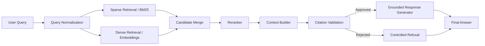
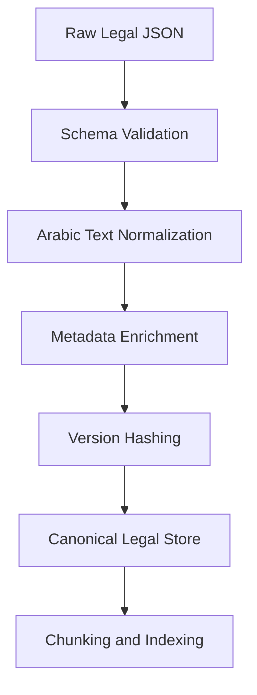
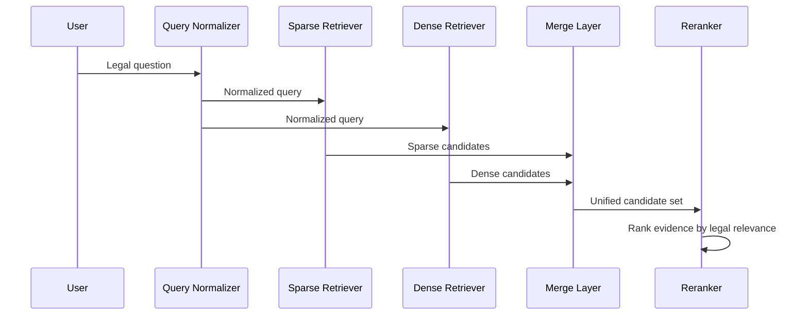
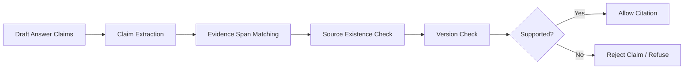
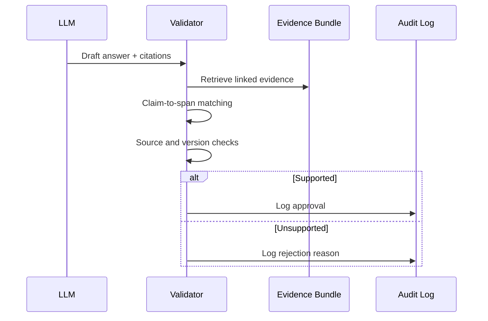
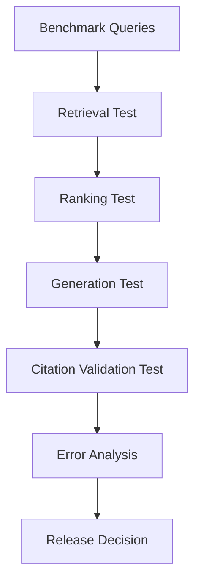

# ALSHAYEB LAW  
## Egyptian Legal Retrieval-Augmented Generation Platform with Strict Citation Grounding and Evidence-Based Response Control

Submitted in Partial Fulfilment of the Requirements for the Course  
**AI Tools**

| Field | Details |
|---|---|
| Project | ALSHAYEB LAW — Egyptian Legal Retrieval-Augmented Generation Platform |
| Version | 1.0 — Project Specification / Architecture Proposal Edition |
| Institution | Military Technical College |
| Programme | iploma in Applied Artificial Intelligence and Data Analytics |
| Project Author | Mohamed Khaled Mahmoud Ibrahim |
| Supervisor | Dr. Ibrahim Basyouni |
| Course | AI Tools |
| Compliance | Evidence-First Architecture \| Citation Grounding \| Traceability \| Version Control |
| Date | July 2026 |
| Classification | Academic Use — Confidential |

***

## 1. Executive Summary

ALSHAYEB LAW is an Egyptian legal RAG platform designed to retrieve authoritative legal evidence and produce grounded answers with strict citation control. The system prioritizes retrieval precision, legal traceability, and source fidelity over conversational fluency. Its core purpose is to support legal research, statute lookup, case-law access, doctrinal support retrieval, and evidence-based legal question answering.

The architecture is intentionally retrieval-first. It is designed so that the model never acts as an autonomous legal authority; instead, it functions as a constrained response layer over verified evidence. This is essential in legal applications, where unsupported claims, fabricated citations, or version mismatches can create serious professional and ethical risk.

The project begins with structured Egyptian statutes and evolves toward court judgments and doctrine as later source layers. The initial release therefore focuses on article-level retrieval, metadata preservation, hybrid search, reranking, citation validation, and reproducible evaluation. The long-term design supports legal scaling without compromising traceability.

***

## 2. Legal and Technical Context

### 2.1 Legal Context

Legal retrieval systems differ from general-purpose assistants because their outputs may be used for legal analysis, drafting, or decision support. In this environment, a wrong article number, a missing exception, or a misattributed judicial principle is not a minor defect; it is a legal reliability failure.

The system must therefore preserve:

- article numbers,
- law names,
- version and effective-date information,
- court and case metadata,
- doctrinal source attribution,
- traceable evidence spans.

The platform must also reject answers when evidence is insufficient. In a legal system, refusal is preferable to speculative generation.

### 2.2 Technical Context

ALSHAYEB LAW is built as a Retrieval-Augmented Generation system with the following sequence:

1. Ingestion of legal sources.
2. Normalization of Arabic legal text.
3. Chunking into retrieval units.
4. Indexing in sparse and dense search layers.
5. Hybrid retrieval.
6. Reranking.
7. Citation validation.
8. Constrained response generation.
9. Evaluation and monitoring.

This architecture separates retrieval from generation so that each layer can be measured independently. That separation is critical because a system can retrieve the correct source but still generate an unsupported response.

***

## 3. Problem Statement

Most legal chat systems optimize for fluency rather than evidentiary correctness. This creates three practical failures:

- statutes may be retrieved incompletely or out of context,
- generated answers may contain unsupported claims,
- users cannot verify the actual legal source behind the response.

For Egyptian law, the problem is amplified by Arabic morphological variation, legal terminology differences, and the need to support multiple source types later, including judgments and doctrine. The central problem is therefore to build a legal RAG system that retrieves the correct evidence, preserves provenance, and prevents unsupported generation.

***

## 4. Objectives

The proposed system has the following objectives:

- Retrieve the exact Egyptian legal article or relevant passage with high precision.
- Support Arabic legal language, including formal Modern Standard Arabic and common query variants.
- Combine lexical and dense retrieval to handle exact citations and semantic paraphrases.
- Enforce citation grounding so every legal claim is traceable to verified evidence.
- Extend from statutes to case law and doctrine without redesigning the retrieval core.

***

## 5. Scope

### 5.1 In Scope

The initial implementation covers:

- structured Egyptian laws in JSON form,
- article-level retrieval,
- Arabic normalization,
- hybrid retrieval,
- reranking,
- citation validation,
- evidence-grounded responses,
- benchmark evaluation,
- audit logging.

### 5.2 Out of Scope for MVP

The first release does **not** fully depend on:

- unstructured judgments,
- OCR-heavy doctrine corpora,
- multi-agent legal workflows,
- knowledge graph reasoning,
- full public deployment.

These can be added later after the statutory pipeline is stable.

***

## 6. Assumptions

The design assumes:

- the law corpus is available in structured JSON,
- each law can be segmented into article-level units,
- version metadata can be added or inferred,
- later documents may require OCR and deeper cleaning,
- all legal outputs must remain version-aware.

The architecture assumes that unsupported content must be rejected rather than guessed.

***

## 7. Functional Requirements

The platform must support the following functions:

1. Legal source ingestion.
2. Arabic normalization.
3. Metadata enrichment.
4. Article-level and section-level chunking.
5. Sparse retrieval.
6. Dense retrieval.
7. Hybrid candidate fusion.
8. Reranking.
9. Citation validation.
10. Controlled response generation.
11. Evaluation and benchmarking.
12. Audit logging and traceability.

***

## 8. Non-Functional Requirements

The system must satisfy the following properties:

- high legal traceability,
- deterministic provenance tracking,
- conservative evidence validation,
- reproducible indexing and evaluation,
- controlled latency,
- maintainable modular architecture,
- future extensibility.

Security and reliability are more important than unconstrained generation quality.

***

## 9. Architecture Overview

The system is organized into seven layers:

1. Ingestion
2. Normalization
3. Retrieval
4. Reranking
5. Context Building
6. Citation Validation
7. Response Generation

The model is intentionally placed at the end of the chain. It is not allowed to invent evidence or override validation rules.

### Mermaid: High-Level Architecture

***

## 10. Data Model

The initial data source is a structured corpus of Egyptian laws. Each legal item should be stored as an addressable record with stable identifiers.

### Recommended fields

- `document_id`
- `source_type`
- `law_name`
- `article_no`
- `section_no`
- `text`
- `effective_date`
- `version`
- `jurisdiction`
- `topic_tags`
- `citation_key`
- `provenance_hash`

For future source layers, such as judgments and doctrine, add:

- `court`
- `case_no`
- `date`
- `holding`
- `commentary_author`
- `publication_source`

This structure supports filtering, auditing, and citation validation.

***

## 11. Ingestion and Normalization

The ingestion layer parses the raw JSON corpus into a canonical legal schema. It must preserve the original legal text and attach version and provenance metadata.

Normalization should standardize:

- Arabic orthographic variants,
- whitespace and punctuation,
- source tags,
- legal numbering patterns.

Normalization must be conservative. It must not alter legal meaning, legal numbering, or exceptions.

### Mermaid: Ingestion Pipeline

***

## 12. Chunking Strategy

For statutes, article-level chunking is the default. A legal article is already a citation-stable unit, which makes it ideal for retrieval and validation.

If an article is long or internally complex, it may be split into smaller sub-chunks, but each chunk must retain:

- parent article reference,
- law name,
- version information,
- span offsets.

For judgments and doctrine later, hierarchical or semantic chunking may be better than fixed-size segmentation.

The guiding rule is simple: do not break legal meaning unless structure requires it.

***

## 13. Retrieval Strategy

The retrieval layer should be hybrid.

### 13.1 Sparse Retrieval

BM25 is essential for:

- exact article wording,
- legal terminology,
- article number matching,
- repeated statutory phrases.

### 13.2 Dense Retrieval

Dense retrieval is essential for:

- paraphrased legal questions,
- semantic matching,
- Arabic query variation,
- indirect issue-to-rule searches.

### 13.3 Hybrid Fusion

The system should merge sparse and dense candidates, then pass them through the reranker. Metadata filters should be applied whenever the query specifies law name, article number, source type, or date.

### Mermaid: Retrieval Flow

***

## 14. Embedding and Reranking

The embedding layer should support Arabic and multilingual retrieval well. The reranker should improve legal precision by evaluating the query and candidate jointly.

The reranker must:

- reduce near-duplicate noise,
- prioritize exact legal matches,
- boost statute-specific evidence,
- preserve recall while improving rank quality.

The reranked result should be a compact evidence bundle for generation.

***

## 15. Citation Grounding

Citation grounding is the central legal safeguard of the system. The platform must guarantee that every legal claim in the final answer is supported by retrieved evidence, not by model inference alone.

### 15.1 Core Principles

- Evidence-first.
- Zero trust toward model-generated citations.
- Conservative validation.
- Deterministic rejection when support is missing.
- Traceability from claim to source span.

### 15.2 Grounding Rules

Each claim in the response must map to:

- one or more retrieved evidence spans,
- a source record in the canonical store,
- a valid source version,
- a supported legal proposition.

If the mapping fails, the claim is removed or the system refuses the answer.

### 15.3 Grounding Flow

### 15.4 Legal Support Model

Support should be evaluated at the level of:

- direct statutory rule,
- exception,
- qualification,
- judicial holding,
- doctrinal explanation.

A citation that exists but does not support the claim is not sufficient.

***

## 16. Citation Validation Layer

The citation validation layer acts as a deterministic evidence gate. It checks whether:

- the cited source exists,
- the cited article or case number is real,
- the source version matches,
- the evidence span supports the claim,
- the citation type matches the source type.

Unsupported claims must be blocked.

### Recommended validation logic

1. Extract claims from the draft answer.
2. Match each claim to evidence spans.
3. Check source existence.
4. Check version validity.
5. Verify support relation.
6. Remove unsupported claims or refuse.
7. Log the decision.

### Mermaid: Validation Sequence

***

## 17. Response Generation

The generator should only format grounded content. It must not produce new legal claims outside the evidence bundle.

The response template should include:

- answer,
- legal reasoning,
- cited sources,
- confidence score,
- limitations if any.

If validation fails, the generator must refuse or return only the supported part.

***

## 18. Evaluation Plan

Evaluation must be modular.

### Retrieval metrics

- Recall@k
- Precision@k
- MRR
- nDCG

### Grounding metrics

- citation accuracy,
- faithfulness,
- unsupported-claim rate,
- version correctness,
- span support rate.

### Operational metrics

- latency,
- throughput,
- memory footprint,
- audit completeness.

### Benchmark slices

- exact article lookup,
- issue-to-rule retrieval,
- statute-only queries,
- paraphrase queries,
- hard negatives,
- later: doctrine and judgment tasks.

### Mermaid: Evaluation Pipeline

***

## 19. Risks and Limitations

The main risks are:

- OCR errors in future documents,
- incorrect article segmentation,
- broken metadata,
- retrieval noise,
- citation hallucination,
- version drift,
- over-aggressive normalization.

Mitigations:

- preserve provenance,
- version every source,
- keep chunking conservative,
- validate citations deterministically,
- refuse unsupported claims.

The first release should stay focused on statutory law until the pipeline is proven stable.

***

## 20. Roadmap Alignment

This project specification aligns with a staged implementation strategy:

- statutes first,
- retrieval baseline second,
- reranking third,
- citation validation fourth,
- generation constraints fifth,
- evaluation and deployment sixth.

The system should not expand to doctrine and judgments until the legal corpus pipeline is stable and reproducible.

***

## 21. Conclusion

ALSHAYEB LAW should be implemented as a retrieval-first legal intelligence system, not as a general-purpose chatbot. Its legal reliability depends on evidence grounding, version control, traceable retrieval, and conservative citation validation.

The architecture proposed here is designed to maximize legal correctness while minimizing hallucination risk. It is suitable for a high-trust legal environment because it treats legal evidence as the source of truth and generation as a constrained formatting layer.

***

## 22. File Recommendation

Save this document as:

**`docs/PROJECT_SPEC.md`**

If you want a more architecture-heavy naming style, use:

**`docs/ARCHITECTURE_PROPOSAL.md`**

If you want, I can now produce **Part 2** in the same style, with:

- a more detailed architecture section,
- a deeper legal requirements section,
- a stronger citation grounding specification,
- and a more formal enterprise-style layout.

