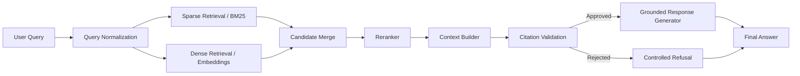
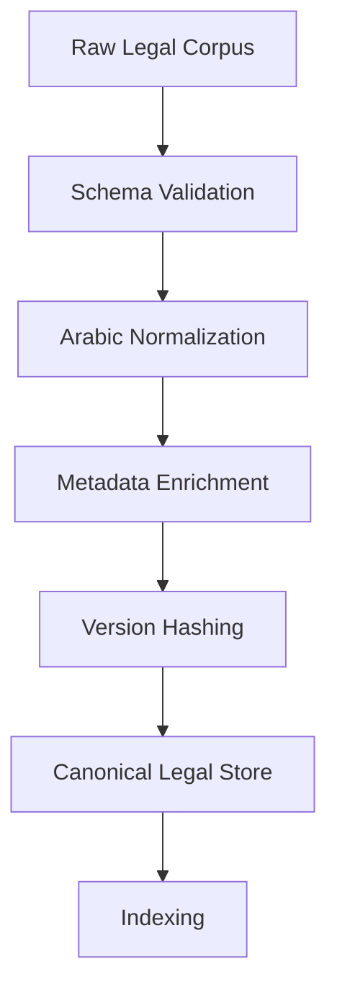
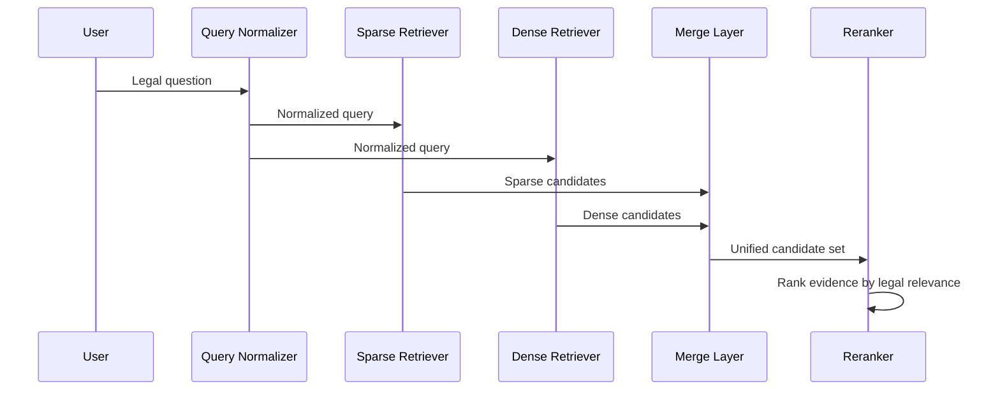
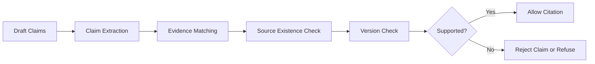
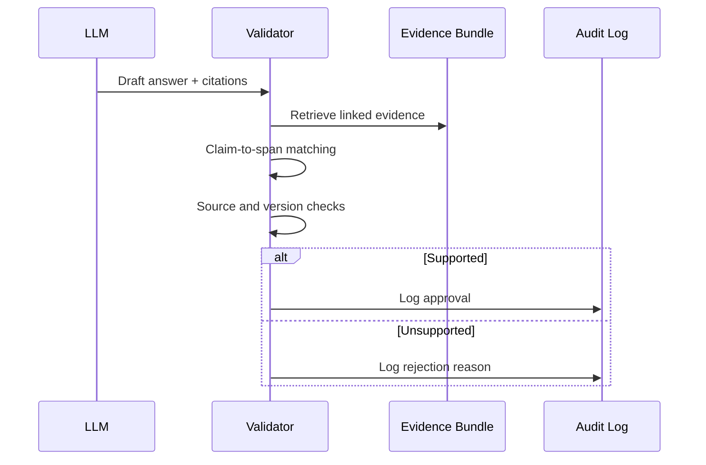
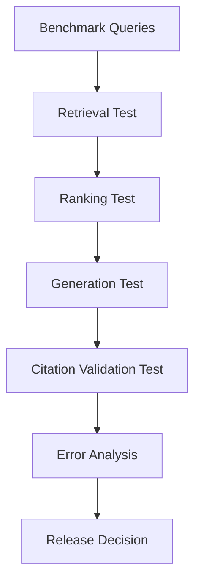

# ALSHAYEB LAW

## Egyptian Legal Retrieval-Augmented Generation Platform with Strict Citation Grounding and Evidence-Based Response Control

Submitted in Partial Fulfilment of the Requirements for the Course
**AI Tools**

***

| Field | Details |
| :-- | :-- |
| Project | ALSHAYEB LAW — Egyptian Legal Retrieval-Augmented Generation Platform |
| Version | 1.0 — Project Specification / Architecture Proposal Edition |
| Institution | [Insert Institution Name] |
| Programme | [Insert Programme Name] |
| Project Author | [Insert Your Name] |
| Supervisor | Dr. Ibrahim Basyouni |
| Course | AI Tools |
| Compliance | Evidence-First Architecture \| Citation Grounding \| Traceability \| Version Control |
| Date | July 2026 |
| Classification | Academic Use — Confidential |

***

## 1. Executive Summary

### 1.1 Purpose

This document defines the formal project specification and architecture proposal for ALSHAYEB LAW, an Egyptian legal Retrieval-Augmented Generation platform designed to provide evidence-grounded legal information access with strict citation control.

### 1.2 System Vision

The system is built as a retrieval-first legal intelligence platform rather than a general-purpose chatbot. Its design objective is to maximize legal precision, preserve source traceability, and ensure that every generated response is grounded in verified legal evidence.

### 1.3 Core Principle

The foundational principle of the system is that legal truth must originate from retrieved sources, not from unconstrained language model generation.

***

## 2. Legal and Technical Context

### 2.1 Legal Context

Explain the legal environment in which the system operates, including the need for article-level precision, source authority, version awareness, and auditable legal reasoning.

### 2.2 Technical Context

Describe why the system uses RAG, hybrid retrieval, reranking, metadata filtering, and citation validation instead of relying on pure generation.

### 2.3 Design Philosophy

State that the platform prioritizes:

- legal correctness,
- evidence traceability,
- controlled generation,
- conservative refusal when evidence is missing.

***

## 3. Problem Statement

### 3.1 Current Limitations

Describe the weaknesses of conventional legal chat interfaces:

- unsupported claims,
- fabricated citations,
- incomplete article retrieval,
- poor source provenance,
- weak version control.

### 3.2 Core Problem

Define the central engineering problem:
How can an Egyptian legal AI system retrieve the right legal evidence, preserve provenance, and prevent unsupported generation at response time?

***

## 4. Objectives

### 4.1 Legal Objectives

- Retrieve exact Egyptian legal articles.
- Support legal reasoning grounded in authentic sources.
- Preserve citation fidelity.
- Maintain version-aware legal responses.

### 4.2 Technical Objectives

- Build a hybrid retrieval pipeline.
- Implement reranking.
- Enforce citation grounding.
- Enable scalable expansion to judgments and doctrine.

***

## 5. Scope and Assumptions

### 5.1 In Scope

- Egyptian statutes in structured format.
- Article-level retrieval.
- Arabic normalization.
- Hybrid search.
- Context building.
- Citation validation.
- Benchmarking.

### 5.2 Out of Scope

- Full conversational assistant behavior.
- Unverified legal generation.
- Unstructured document ingestion in the first release.
- Multi-agent workflows in the initial phase.

### 5.3 Assumptions

- Source data exists in structured JSON or equivalent format.
- Legal articles can be segmented as atomic retrieval units.
- Future sources may require OCR and hierarchical chunking.

***

## 6. Functional Requirements

### 6.1 Ingestion

- Parse legal files.
- Preserve provenance.
- Attach metadata.
- Validate schema consistency.

### 6.2 Retrieval

- Support BM25 retrieval.
- Support dense retrieval.
- Merge candidate sets.
- Apply metadata filters.

### 6.3 Reasoning Support

- Build evidence bundles.
- Map claims to source spans.
- Reject unsupported claims.

### 6.4 Output Control

- Generate only grounded answers.
- Refuse unsupported questions.
- Display citations transparently.

***

## 7. Non-Functional Requirements

### 7.1 Reliability

The system must remain stable under legal queries and must avoid hallucinated legal content.

### 7.2 Traceability

Every answer must be traceable back to a source record.

### 7.3 Reproducibility

Indexing, retrieval, and evaluation must be reproducible.

### 7.4 Maintainability

The architecture must allow new laws, judgments, and doctrinal sources to be added without redesign.

***

## 8. Proposed Architecture

### 8.1 High-Level Layers

The system should be organized into the following layers:

1. Ingestion Layer
2. Normalization Layer
3. Retrieval Layer
4. Reranking Layer
5. Context Builder
6. Citation Validation Layer
7. Response Generation Layer

### 8.2 Architectural Separation

Explain that retrieval and generation are intentionally separated so the language model does not become the authority on legal truth.

### 8.3 Core Architecture Diagram

***

## 9. Data Model

### 9.1 Core Legal Entity

Define the article-level legal record as the atomic retrieval unit.

### 9.2 Recommended Metadata Fields

- document_id
- source_type
- law_name
- article_no
- section_no
- text
- effective_date
- version
- jurisdiction
- topic_tags
- citation_key
- provenance_hash

### 9.3 Future Extensions

For judgments and doctrine, add:

- court
- case_no
- date
- holding
- commentary_author
- publication_source

***

## 10. Ingestion and Normalization

### 10.1 Ingestion Pipeline

Describe how the source corpus enters the system.

### 10.2 Arabic Normalization

Explain normalization rules for Arabic orthography and formatting without altering legal meaning.

### 10.3 Metadata Enrichment

Explain how metadata is attached to each retrieval unit.

### 10.4 Suggested Diagram

***

## 11. Chunking Strategy

### 11.1 Statutory Chunking

Use article-level chunks as the default.

### 11.2 Long Article Handling

Split long articles only when necessary, preserving parent references.

### 11.3 Future Unstructured Sources

Use hierarchical or semantic chunking for judgments and doctrine.

### 11.4 Design Rule

Do not break legal meaning unless the document structure requires it.

***

## 12. Retrieval Strategy

### 12.1 Sparse Retrieval

Explain BM25 for exact wording and article-number matching.

### 12.2 Dense Retrieval

Explain semantic retrieval for paraphrases and informal queries.

### 12.3 Hybrid Fusion

Explain score fusion between sparse and dense results.

### 12.4 Metadata Filtering

Explain filtering by law name, article number, date, and source type.

### 12.5 Retrieval Flow Diagram

***

## 13. Embedding and Reranking Strategy

### 13.1 Embedding Layer

Specify the embedding model selection criteria and multilingual support.

### 13.2 Reranking Layer

Explain why cross-encoder reranking is necessary in legal retrieval.

### 13.3 Reranking Objective

Reduce near-duplicates, preserve recall, improve legal precision.

***

## 14. Citation Grounding

### 14.1 Purpose

This is the most critical legal safety layer. It ensures that the system only produces claims that are supported by retrieved evidence.

### 14.2 Grounding Policy

- Evidence first.
- No unsupported citations.
- No invented legal claims.
- No silent source substitution.

### 14.3 Claim-to-Evidence Mapping

Every statement must map to:

- source span,
- legal record,
- valid version,
- relevant authority.

### 14.4 Validation Rules

- If a claim is unsupported, remove it.
- If the citation is invalid, reject it.
- If evidence is incomplete, refuse the answer.

### 14.5 Grounding Flow Diagram

***

## 15. Citation Validation Layer

### 15.1 Validation Objectives

Describe how the system checks that citations correspond to real and retrieved sources.

### 15.2 Validation Steps

- claim extraction,
- span matching,
- source verification,
- version verification,
- output filtering,
- audit logging.

### 15.3 Validation Sequence

***

## 16. Response Generation

### 16.1 Generator Role

The generator formats grounded evidence into a human-readable legal answer.

### 16.2 Generator Constraints

The generator must not add unsupported legal assertions.

### 16.3 Refusal Policy

When evidence is insufficient, the system must refuse rather than speculate.

***

## 17. Evaluation Plan

### 17.1 Retrieval Metrics

- Recall@k
- Precision@k
- MRR
- nDCG

### 17.2 Grounding Metrics

- citation accuracy
- faithfulness
- unsupported claim rate
- version correctness

### 17.3 Benchmark Design

Include:

- exact article lookup,
- issue-to-rule retrieval,
- paraphrase queries,
- hard negatives,
- judgment/doctrine retrieval later.

### 17.4 Evaluation Pipeline

***

## 18. Risks and Limitations

### 18.1 Technical Risks

- OCR noise.
- Metadata errors.
- Retrieval drift.
- Version mismatch.
- Over-segmentation.

### 18.2 Legal Risks

- Unsupported legal claims.
- Misattributed authority.
- Ambiguous query interpretation.

### 18.3 Mitigation Strategy

Use conservative chunking, strict validation, source provenance, and controlled refusal.

***

## 19. Roadmap Alignment

Explain how this specification aligns with later development stages:

- statutory corpus first,
- retrieval baseline second,
- reranking third,
- grounding fourth,
- evaluation fifth,
- expansion to judgments and doctrine later.

***

## 20. Codebase Integration

### 20.1 How to Link This Document to Code

This file should act as the architecture contract for the codebase. Every major folder in the repository should map to a section in this document.

### 20.2 Recommended Mapping

- `data/` → Section 9 and 10.
- `src/ingestion/` → Section 10.
- `src/normalization/` → Section 10.
- `src/retrieval/` → Section 12 and 13.
- `src/reranking/` → Section 13.
- `src/validation/` → Section 14 and 15.
- `src/generation/` → Section 16.
- `benchmarks/` → Section 17.
- `docs/` → This document and related specifications.

### 20.3 Source of Truth Rule

Any code change that affects retrieval logic, citation handling, or architecture should be reflected in this document.

### 20.4 Versioning Rule

If the codebase changes materially, update:

- `PROJECT_SPEC.md`
- `ROADMAP.md`
- `DEVELOPMENT_PLAN.md`

### 20.5 Example Cross-References

You can reference this document inside code comments, commit messages, README sections, and design notes as the authoritative architecture baseline.

***

## 21. File Structure Recommendation

### 21.1 Documentation

- `docs/PROJECT_SPEC.md`
- `docs/ROADMAP.md`
- `docs/DEVELOPMENT_PLAN.md`
- `docs/ARCHITECTURE.md`

### 21.2 Code

- `src/`
- `tests/`
- `data/`
- `benchmarks/`
- `prompts/`

### 21.3 Governance

- `LICENSE`
- `README.md`
- `CHANGELOG.md`

***

## 22. Conclusion

ALSHAYEB LAW should be implemented as a retrieval-first legal intelligence platform with strict citation grounding and evidence-based response control. The system must favor legal correctness, provenance, and traceability over generative fluency. This document serves as the primary architectural reference for the project and should remain synchronized with the codebase throughout development.

***

إذا تريد، أقدر الآن أحول هذا الهيكل إلى **النسخة الكاملة النهائية بصيغة Markdown جاهزة للنسخ**، بحيث تكون كتابة المستند نفسها منسقة ومكتوبة بالكامل، وليس مجرد هيكل.

